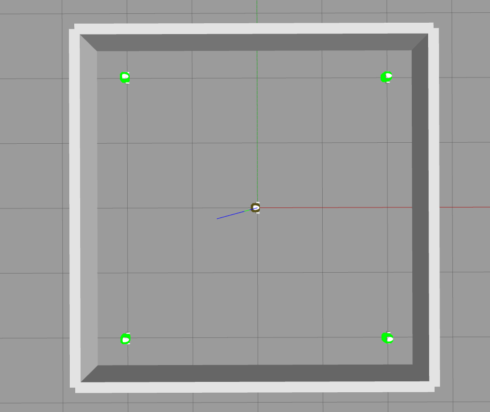
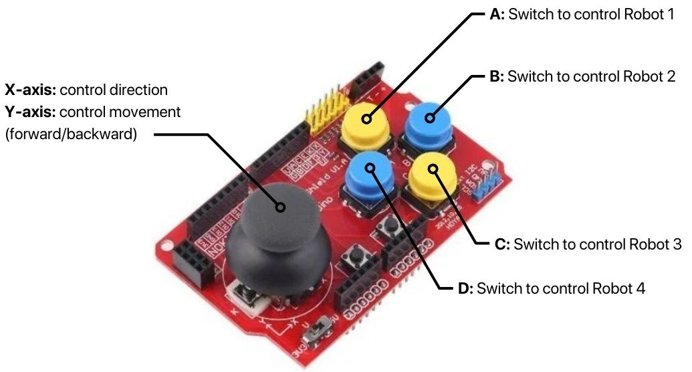

# FRA501 Mini Project RoboticsDev: Chasing Game

## Project Overviews

### Describtion
This project is a Robot Chasing Game involving 5 robots, with 4 chasing robots and 1 escape robot. Players control the chasing robots through a joystick, allowing control of only one chasing robot at a time, with a button to switch between them. The escape robot is controlled by tilting an IMU, responding to rotations around the x and y axes to navigate and evade capture. The game ends when one of the chasing robots successfully contacts the escape robot

### Schematics of System


The schematics consist of two parts:
- ROS2, which is used for simulation in Gazebo.
- micro-ROS, which is the controller that is controlled by a joystick and IMU. 

## ROS 2
### Gazebo
This part involves a simulation using the `turtlebot3_burger.urdf` file and SDF model file to simulate 5 turtlebot, each having the namespace `/robotx` (where x is the number of the robot). The simulation uses the plugin `libgazebo_ros_diff_drive.so` to control the Turtlebots via the topic `/cmd_vel`. In robot 5, the escape robot has an additional plugin, `libgazebo_ros_bumper.so`, to detect whether other robots are in contact with it, thereby ending the game.


### contact node
This node used to tranfrom message from `gazebo_msgs/ContactsState` to `std_msgs/Bool` to report to the IMU node whether robot 5 is in contact with others.

## micro-ROS
### Joystick

This node, named `/joy`, is created to receive input data from a joystick through DMA and GPIO Input. The node processes the joystick input, translating it into linear-velocity, and then publishes these commands via the topic `/<Robot Name>/cmd_vel`. This setup enables robot control using a joystick. Each button on the joystick is assigned a specific function, allowing different control actions as shown in the figure below.



### IMU
This node, named `/imu_node`, is created to receive input data from an IMU through I2C input. The input includes rotational speed from the gyroscope and acceleration from the accelerometer. The node performs sensor fusion using a Kalman filter to convert the data to rotation around the x-axis and y-axis. Then it translates this data into linear velocity and publishes these commands via the topic `/robot5/cmd_vel`. And this node subscribes messages from contact node via topic `/contact`. If the message is true, this node will send a service client request to `/reset_world` to reset simulation. Additionally, if the button on the STM32 board is pushed, it will also send this service client request to reset the game.

## How to run
- run Simulation and IMU calibration
```
ros2 launch turtlebot3_multi_robot mini_project.launch.py
```
- run micro-ros
```
ros2 run micro_ros_agent micro_ros_agent serial -b 2000000 --dev /dev/ttyACM0
```
